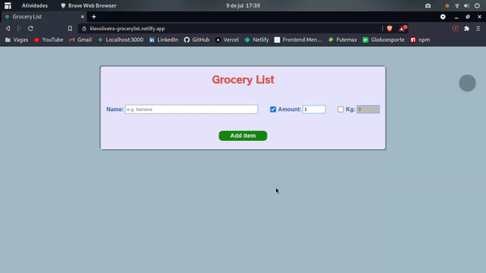

# Grocery List App / App de Lista de Compras
[](https://github.com/KlevertonOliveira/grocery-list-app-ReactJS/blob/master/LICENSE)

---

## :art: Layout web



---

[Project Presentation](https://klevoliveira-grocerylist.netlify.app/) /
[Apresentação do Projeto](https://klevoliveira-grocerylist.netlify.app/)

---

## :mag_right: About the project / Sobre o projeto

Grocery List is a Front End application created with the objective of practicing the development of web applications using the ReactJS library. The application is based on the project called Grocery Bud by John Smilga in his course called Full React Course 2020.

The project consists of adding, manipulating and removing items from a shopping list, going beyond the original project by implementing the idea of amount/kg and the logic involved for this operation, as well as modifying the way information is displayed by making use of a table of data to better organize the user interaction with the application. Finally, the application makes use of LocalStorage to store the information and, therefore, be able to show it to the user the next time he/she accesses the application.

---

Grocery List é uma aplicação Front End criada com o objetivo de praticar o desenvolvimento de aplicações web utilizando a biblioteca ReactJS. A aplicação toma como base o projeto denominado Grocery Bud de John Smilga em seu curso denominado Full React Course 2020.

O projeto consiste na adição, manipulação e remoção de items de uma lista de compras, indo além do projeto original ao implementar a ideia de quantidade/kg e a lógica envolvida para esta operação, além de modificar a forma como as informações são exibidas ao fazer uso de uma tabela de dados para organizar melhor a interação do usuário com o aplicativo. Por fim, o aplicativo faz uso do LocalStorage para armazenar as informações e, com isso, ser capaz de mostrá-las ao usuário na próxima vez que acessar a aplicação.

---

## :gear: Technologies Used / Tecnologias utilizadas

### Front end
- HTML5
- CSS3
- Javascript ES6
- ReactJS

## :file_folder: How to run the project / Como executar o projeto

Prerequisites / Pré-requisitos: npm / yarn

```bash
# Clone repository / Clonar repositório
git clone https://github.com/KlevertonOliveira/grocery-list-app-ReactJS.git

# Enter the project folder / Entrar na pasta do projeto
cd grocery-list-app-ReactJS

# Install dependencies / Instalar dependências
yarn install

# Run the project / Executar o projeto
yarn start
```

## :raising_hand_man: Author / Autor

José Kleverton Yvens Oliveira

https://www.linkedin.com/in/klevertonoliveira/

